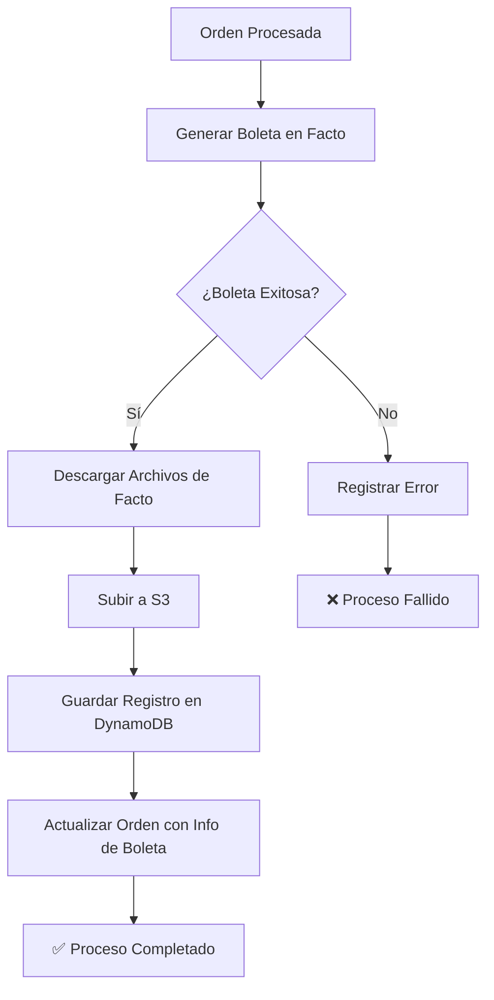

# 📄 Sistema de Almacenamiento de Boletas Electrónicas

## 🎯 **Resumen**

Se ha implementado un sistema completo para almacenar y gestionar las boletas electrónicas generadas por Facto, incluyendo:

- **Almacenamiento en S3**: Descarga y guarda automáticamente los archivos PDF, XML y timbres
- **Trazabilidad en DynamoDB**: Registra todas las boletas generadas con su estado
- **Integración con órdenes**: Actualiza las órdenes con información de boletas
- **URLs firmadas**: Genera URLs seguras para acceder a los archivos

## 🏗️ **Infraestructura**

### **S3 Bucket para Boletas**
- **Nombre**: `paris-licenses-invoices-xxxxxxxx`
- **Estructura de archivos**:
  ```
  invoices/
  ├── 2024/
  │   ├── 01/
  │   │   ├── ORD-12345/
  │   │   │   ├── 123456.pdf
  │   │   │   ├── 123456.xml
  │   │   │   ├── 123456.pdfcedible
  │   │   │   └── 123456.timbre
  │   │   └── ORD-12346/
  │   └── 02/
  └── 2025/
  ```
- **Configuración**: Versionado habilitado, acceso privado

### **DynamoDB Table para Trazabilidad**
- **Nombre**: `paris-licenses-invoices`
- **Estructura**:
  ```json
  {
    "orderNumber": "ORD-12345",     // Partition Key
    "folio": 123456,                // Sort Key
    "status": 0,                    // 0=success, 1=error, 2=draft
    "message": "Boleta generada exitosamente",
    "createdAt": "2024-01-15T10:30:00Z",
    "s3Files": {
      "pdf": "https://s3.amazonaws.com/...",
      "xml": "https://s3.amazonaws.com/...",
      "pdfcedible": "https://s3.amazonaws.com/...",
      "timbre": "https://s3.amazonaws.com/..."
    },
    "originalLinks": {
      "pdf": "https://facto.cl/...",
      "xml": "https://facto.cl/..."
    },
    "ttl": 1704060600               // 1 año de TTL
  }
  ```

## 🔧 **Servicios Implementados**

### **S3Service**
- **Función**: Descarga archivos de Facto y los sube a S3
- **Características**:
  - URLs firmadas con expiración de 30 días
  - Metadatos de archivo original
  - Manejo de errores por archivo individual

### **InvoicesService**
- **Función**: Gestiona registros de boletas en DynamoDB
- **Métodos**:
  - `saveInvoiceRecord()`: Guarda registro de boleta
  - `getInvoiceRecord()`: Obtiene boleta por orden y folio
  - `getInvoicesForOrder()`: Lista todas las boletas de una orden
  - `hasExistingInvoice()`: Verifica si ya existe boleta

### **FactoService (Actualizado)**
- **Nuevas funcionalidades**:
  - Guardado automático de archivos en S3
  - Registro automático en DynamoDB
  - Verificación de boletas existentes
  - Actualización de órdenes con información de boletas

## 📊 **Flujo de Trabajo**



## 🔐 **Permisos IAM**

El Lambda tiene los siguientes permisos adicionales:

```json
{
  "Effect": "Allow",
  "Action": [
    "s3:GetObject",
    "s3:PutObject",
    "s3:DeleteObject"
  ],
  "Resource": "arn:aws:s3:::paris-licenses-invoices-*/*"
},
{
  "Effect": "Allow",
  "Action": ["s3:ListBucket"],
  "Resource": "arn:aws:s3:::paris-licenses-invoices-*"
},
{
  "Effect": "Allow",
  "Action": [
    "dynamodb:GetItem",
    "dynamodb:PutItem",
    "dynamodb:UpdateItem",
    "dynamodb:DeleteItem",
    "dynamodb:Query",
    "dynamodb:Scan"
  ],
  "Resource": "arn:aws:dynamodb:*:*:table/paris-licenses-invoices*"
}
```

## 🌍 **Variables de Entorno**

```bash
# Configuración de almacenamiento de boletas
INVOICES_BUCKET=paris-licenses-invoices-xxxxxxxx
INVOICES_TABLE_NAME=paris-licenses-invoices

# Configuración de Facto
FACTO_TEST_MODE=true
FACTO_USER=76373632-6/786c
FACTO_PASS=d7364e0b3edcfce2547dee444850cf3d
```

## 🚀 **Despliegue**

### **1. Actualizar Terraform**
```bash
cd terraform
terraform plan
terraform apply
```

### **2. Actualizar Variables de Entorno**
```bash
# En el archivo .env o variables de Lambda
INVOICES_BUCKET=$(terraform output -raw invoices_bucket_name)
INVOICES_TABLE_NAME=$(terraform output -raw invoices_table_name)
```

### **3. Desplegar Código**
```bash
npm run build
./deploy.sh
```

## 📈 **Beneficios**

### **✅ Ventajas**
- **Persistencia**: Las boletas se guardan permanentemente en S3
- **Trazabilidad**: Registro completo de todas las boletas generadas
- **Acceso**: URLs firmadas para acceder a los archivos
- **Escalabilidad**: S3 y DynamoDB manejan grandes volúmenes
- **Seguridad**: Archivos privados con acceso controlado

### **🔄 Comparación con Antes**
| Aspecto | Antes | Ahora |
|---------|-------|-------|
| **Almacenamiento** | ❌ Solo links temporales | ✅ Archivos en S3 |
| **Trazabilidad** | ❌ Solo logs | ✅ Base de datos completa |
| **Acceso** | ❌ Links expiran en 30 días | ✅ URLs firmadas renovables |
| **Búsqueda** | ❌ No posible | ✅ Por orden, folio, estado |
| **Respaldo** | ❌ Dependiente de Facto | ✅ Independiente |

## 🔍 **Consultas Disponibles**

### **Obtener boletas de una orden**
```typescript
const invoices = await invoicesService.getInvoicesForOrder('ORD-12345');
```

### **Verificar si existe boleta**
```typescript
const hasInvoice = await invoicesService.hasExistingInvoice('ORD-12345');
```

### **Obtener URL de archivo**
```typescript
const pdfUrl = await s3Service.getPresignedUrl('invoices/2024/01/ORD-12345/123456.pdf');
```

## 🛠️ **Mantenimiento**

### **Limpieza Automática**
- **TTL**: Los registros se eliminan automáticamente después de 1 año
- **Archivos S3**: Se pueden configurar políticas de ciclo de vida

### **Monitoreo**
- **CloudWatch Logs**: Todos los eventos se registran
- **Métricas**: Número de boletas generadas, errores, etc.

## 🚨 **Consideraciones**

1. **Costo**: S3 y DynamoDB tienen costos por uso
2. **Latencia**: Descarga y subida de archivos añade tiempo
3. **Espacio**: Los archivos se almacenan permanentemente
4. **Seguridad**: URLs firmadas tienen expiración limitada

## 📝 **Próximos Pasos**

1. **Dashboard**: Mostrar boletas en la interfaz web
2. **API**: Endpoints para consultar boletas
3. **Notificaciones**: Alertas por errores en generación
4. **Reportes**: Estadísticas de boletas generadas
